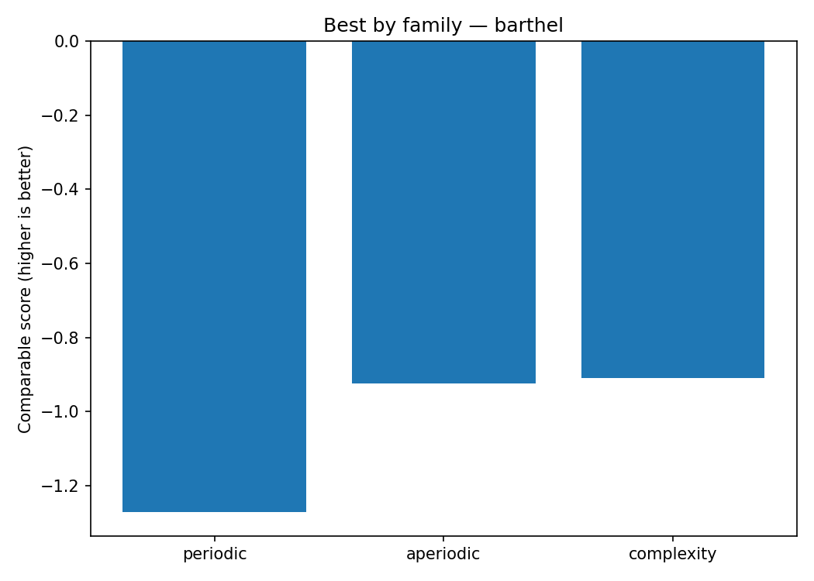
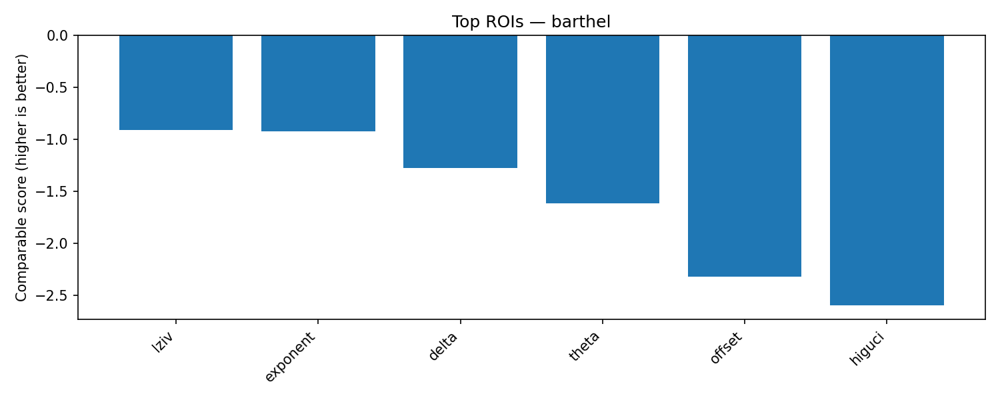
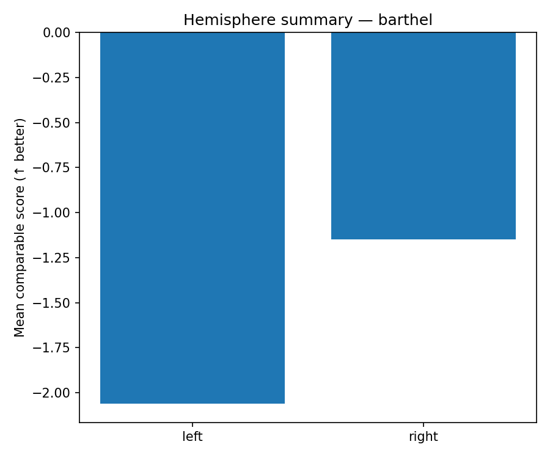
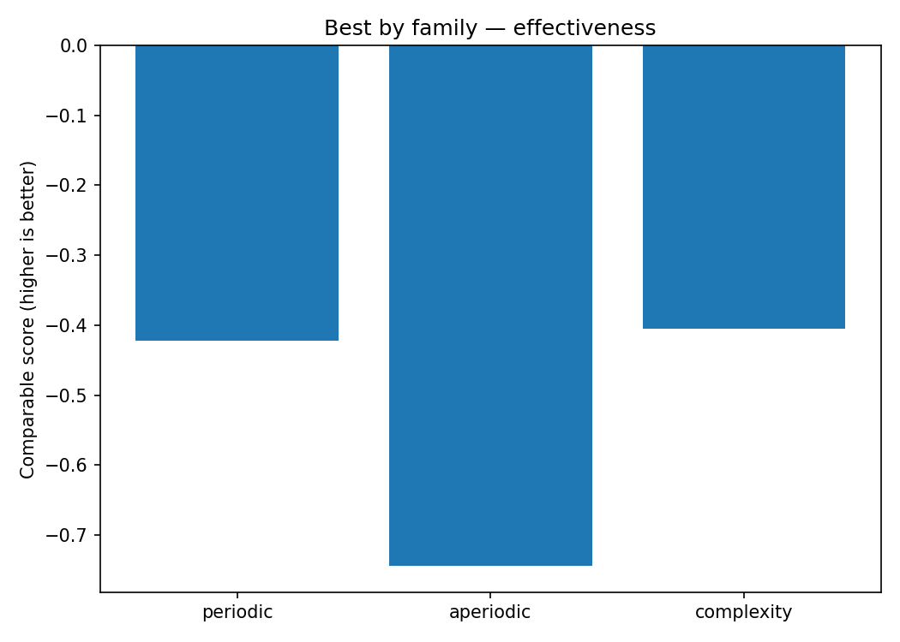
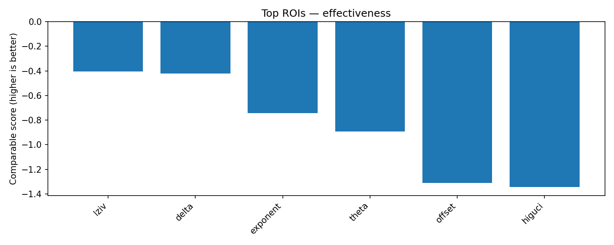
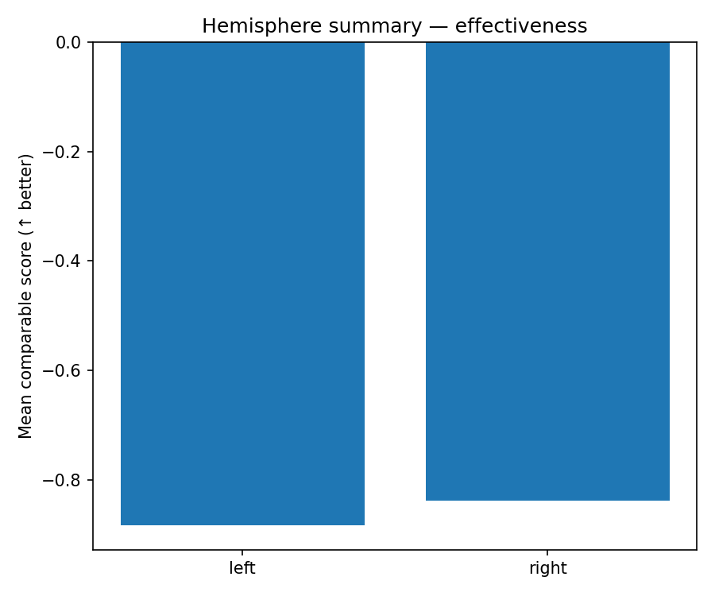
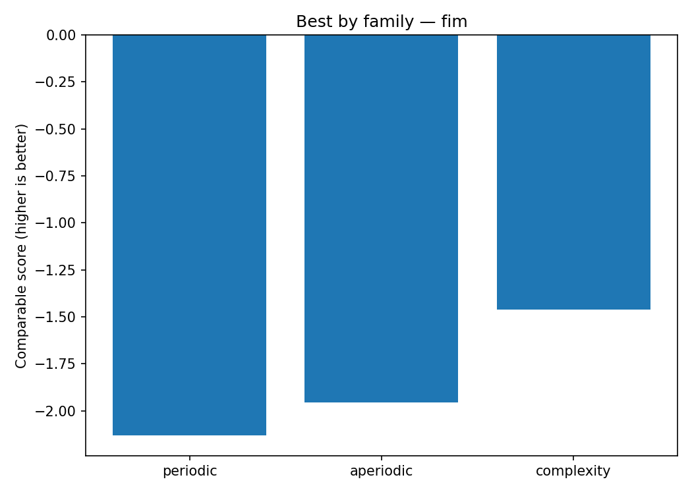
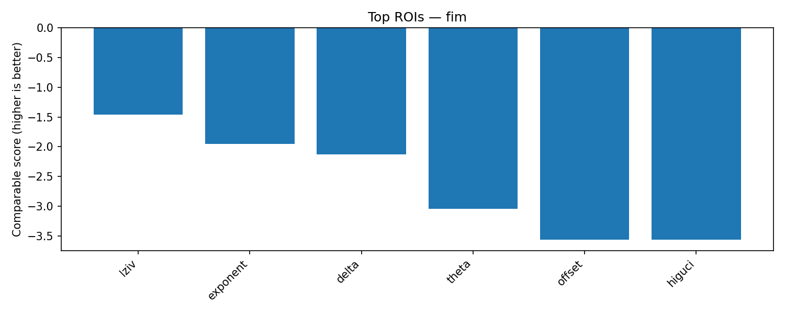
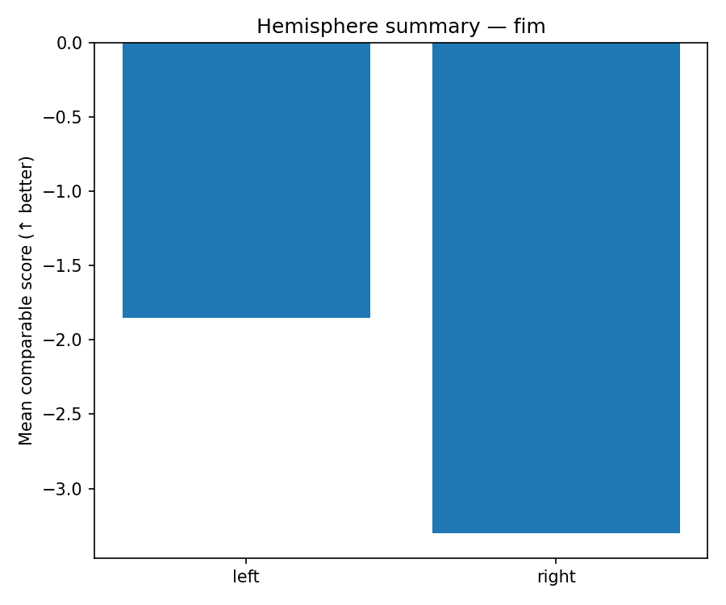

# Cross-analysis Recap

Confronto tra **periodic (delta/theta)**, **aperiodic (exponent/offset)** e **complexity (lziv/higuci)** sui target (Barthel, FIM, Effectiveness).
Gli score sono resi comparabili come *higher is better* (MAE/RMSE negati).

## Target: barthel

**Best by family**:

- periodic: `r2=-1.2724` @ ROI `delta` (dir=higher_is_better)
- aperiodic: `r2=-0.9240` @ ROI `exponent` (dir=higher_is_better)
- complexity: `r2=-0.9105` @ ROI `lziv` (dir=higher_is_better)

**Top ROIs overall**:

1. `lziv` — r2=-0.9105 (complexity)
2. `exponent` — r2=-0.9240 (aperiodic)
3. `delta` — r2=-1.2724 (periodic)
4. `theta` — r2=-1.6123 (periodic)
5. `offset` — r2=-2.3165 (aperiodic)

## Target: effectiveness

**Best by family**:

- periodic: `r2=-0.4220` @ ROI `delta` (dir=higher_is_better)
- aperiodic: `r2=-0.7445` @ ROI `exponent` (dir=higher_is_better)
- complexity: `r2=-0.4052` @ ROI `lziv` (dir=higher_is_better)

**Top ROIs overall**:

1. `lziv` — r2=-0.4052 (complexity)
2. `delta` — r2=-0.4220 (periodic)
3. `exponent` — r2=-0.7445 (aperiodic)
4. `theta` — r2=-0.8909 (periodic)
5. `offset` — r2=-1.3103 (aperiodic)

## Target: fim

**Best by family**:

- periodic: `r2=-2.1327` @ ROI `delta` (dir=higher_is_better)
- aperiodic: `r2=-1.9557` @ ROI `exponent` (dir=higher_is_better)
- complexity: `r2=-1.4623` @ ROI `lziv` (dir=higher_is_better)

**Top ROIs overall**:

1. `lziv` — r2=-1.4623 (complexity)
2. `exponent` — r2=-1.9557 (aperiodic)
3. `delta` — r2=-2.1327 (periodic)
4. `theta` — r2=-3.0416 (periodic)
5. `offset` — r2=-3.5650 (aperiodic)

